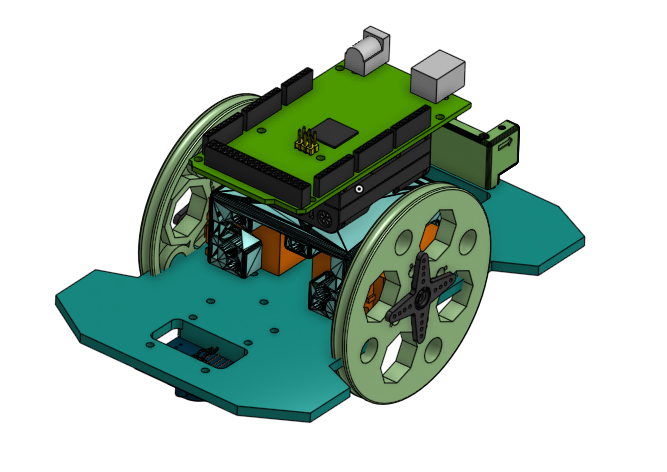

# Clumsee
Clumsee is a robot that has a color recognition sensor in order to extend games based on election on a color board table.

<h1>Clumsee</h1>

Libraries used on this model
<ul>
	<li>TCS3200</li>
	<li>IMU_MPU9250</li>
	<li>Madgwick</li>
	
</ul>

There are two different models one Color Sensor or with with two color sensors for other applications
<ul>
	<li>One Color Sensor</li>
	<li>Two Color Sensors</li>
</ul>

<h2>IMU Visualization and control</h2>
It also can read Roll, pitch Yaw Orientation for different purpose.

<h2>Remote Control</h2>
This model can be controlled by an Android App or other devices connected with Bluetoot HC-05.

<h3>App Inventor Programm</h3>

<h3>Esplora Remote Control</h3>

Documentation about Clumsee can be readed in <a href="http://blascarr.com/courses/clumsee/"> Blascarr Webpage</a>
